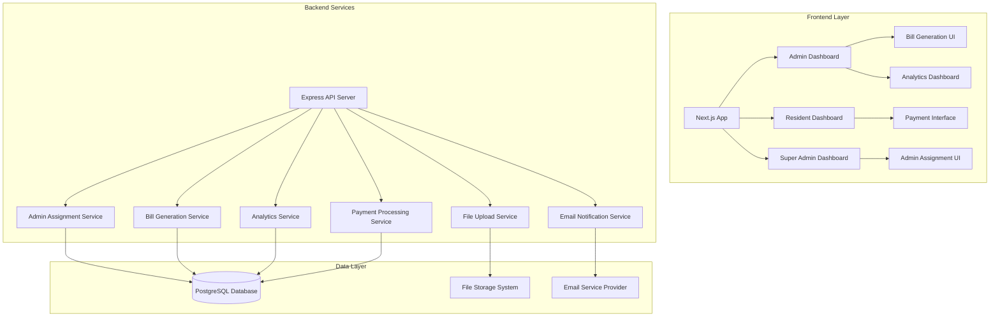

# Flat Expense Tracker - Critical Improvements Design

## Overview

This design document outlines the implementation strategy for critical improvements to the Flat Expense Management System. The improvements focus on filling identified gaps in admin assignment, bill generation, payment processing, notifications, file management, analytics, and user experience enhancements.

## Architecture

### System Architecture Enhancement



### Database Schema Enhancements

#### New Tables

```sql
-- Admin Building Assignments
CREATE TABLE admin_building_assignments (
    id UUID PRIMARY KEY DEFAULT uuid_generate_v4(),
    admin_id UUID NOT NULL REFERENCES users(id) ON DELETE CASCADE,
    building_id UUID NOT NULL REFERENCES buildings(id) ON DELETE CASCADE,
    assigned_by UUID NOT NULL REFERENCES users(id),
    assigned_at TIMESTAMP WITH TIME ZONE DEFAULT CURRENT_TIMESTAMP,
    is_active BOOLEAN DEFAULT true,
    UNIQUE(admin_id, building_id)
);

-- Email Templates
CREATE TABLE email_templates (
    id UUID PRIMARY KEY DEFAULT uuid_generate_v4(),
    name VARCHAR(100) NOT NULL UNIQUE,
    subject VARCHAR(255) NOT NULL,
    html_content TEXT NOT NULL,
    text_content TEXT,
    variables JSONB,
    created_at TIMESTAMP WITH TIME ZONE DEFAULT CURRENT_TIMESTAMP
);

-- User Preferences
CREATE TABLE user_preferences (
    id UUID PRIMARY KEY DEFAULT uuid_generate_v4(),
    user_id UUID NOT NULL REFERENCES users(id) ON DELETE CASCADE,
    email_notifications BOOLEAN DEFAULT true,
    sms_notifications BOOLEAN DEFAULT false,
    notification_types JSONB DEFAULT '[]',
    created_at TIMESTAMP WITH TIME ZONE DEFAULT CURRENT_TIMESTAMP,
    updated_at TIMESTAMP WITH TIME ZONE DEFAULT CURRENT_TIMESTAMP,
    UNIQUE(user_id)
);

-- File Uploads
CREATE TABLE file_uploads (
    id UUID PRIMARY KEY DEFAULT uuid_generate_v4(),
    filename VARCHAR(255) NOT NULL,
    original_name VARCHAR(255) NOT NULL,
    mime_type VARCHAR(100) NOT NULL,
    file_size INTEGER NOT NULL,
    file_path VARCHAR(500) NOT NULL,
    uploaded_by UUID NOT NULL REFERENCES users(id),
    entity_type VARCHAR(50), -- 'complaint', 'bill', 'profile'
    entity_id UUID,
    created_at TIMESTAMP WITH TIME ZONE DEFAULT CURRENT_TIMESTAMP
);
```

#### Schema Modifications

```sql
-- Add missing columns to existing tables
ALTER TABLE complaints ADD COLUMN IF NOT EXISTS attachments UUID[] DEFAULT '{}';
ALTER TABLE bills ADD COLUMN IF NOT EXISTS attachment_id UUID REFERENCES file_uploads(id);
ALTER TABLE users ADD COLUMN IF NOT EXISTS avatar_id UUID REFERENCES file_uploads(id);

-- Add indexes for performance
CREATE INDEX idx_admin_building_assignments_admin ON admin_building_assignments(admin_id);
CREATE INDEX idx_admin_building_assignments_building ON admin_building_assignments(building_id);
CREATE INDEX idx_file_uploads_entity ON file_uploads(entity_type, entity_id);
```

## UI/UX Design Improvements

### Design System Enhancement

#### Color Palette & Theming
```typescript
interface ThemeColors {
  primary: {
    50: '#eff6ff',
    500: '#3b82f6',
    600: '#2563eb',
    700: '#1d4ed8'
  };
  success: {
    50: '#f0fdf4',
    500: '#22c55e',
    600: '#16a34a'
  };
  warning: {
    50: '#fffbeb',
    500: '#f59e0b',
    600: '#d97706'
  };
  error: {
    50: '#fef2f2',
    500: '#ef4444',
    600: '#dc2626'
  };
  neutral: {
    50: '#f8fafc',
    100: '#f1f5f9',
    200: '#e2e8f0',
    500: '#64748b',
    700: '#334155',
    900: '#0f172a'
  };
}
```

#### Typography System
```typescript
interface TypographyScale {
  display: {
    fontSize: '3.75rem',
    lineHeight: '1',
    fontWeight: '800'
  };
  h1: {
    fontSize: '2.25rem',
    lineHeight: '2.5rem',
    fontWeight: '700'
  };
  h2: {
    fontSize: '1.875rem',
    lineHeight: '2.25rem',
    fontWeight: '600'
  };
  h3: {
    fontSize: '1.5rem',
    lineHeight: '2rem',
    fontWeight: '600'
  };
  body: {
    fontSize: '1rem',
    lineHeight: '1.5rem',
    fontWeight: '400'
  };
  caption: {
    fontSize: '0.875rem',
    lineHeight: '1.25rem',
    fontWeight: '400'
  };
}
```

#### Spacing & Layout System
```typescript
interface SpacingSystem {
  xs: '0.25rem',
  sm: '0.5rem',
  md: '1rem',
  lg: '1.5rem',
  xl: '2rem',
  '2xl': '3rem',
  '3xl': '4rem'
}

interface LayoutBreakpoints {
  sm: '640px',
  md: '768px',
  lg: '1024px',
  xl: '1280px',
  '2xl': '1536px'
}
```

### Enhanced Dashboard Layouts

#### Responsive Dashboard Grid
```typescript
interface DashboardLayoutProps {
  sidebar: {
    width: 'fixed' | 'collapsible';
    position: 'left' | 'right';
    overlay: boolean;
  };
  header: {
    height: number;
    sticky: boolean;
    showBreadcrumbs: boolean;
  };
  content: {
    maxWidth: string;
    padding: string;
    scrollable: boolean;
  };
}

interface ResponsiveDashboard {
  mobile: {
    sidebar: 'overlay' | 'bottom-nav';
    header: 'compact' | 'full';
    content: 'single-column';
  };
  tablet: {
    sidebar: 'collapsible' | 'fixed';
    header: 'full';
    content: 'two-column';
  };
  desktop: {
    sidebar: 'fixed' | 'expanded';
    header: 'full';
    content: 'multi-column';
  };
}
```

#### Enhanced Navigation System
```typescript
interface NavigationItem {
  id: string;
  label: string;
  icon: React.ComponentType;
  href?: string;
  badge?: {
    count: number;
    variant: 'primary' | 'warning' | 'error';
  };
  children?: NavigationItem[];
  permissions?: string[];
}

interface NavigationProps {
  items: NavigationItem[];
  currentPath: string;
  collapsed: boolean;
  onToggleCollapse: () => void;
  userRole: string;
}
```

### Modern UI Components

#### Enhanced Data Tables
```typescript
interface DataTableProps<T> {
  data: T[];
  columns: ColumnDef<T>[];
  pagination?: {
    pageSize: number;
    showSizeSelector: boolean;
    showInfo: boolean;
  };
  sorting?: {
    enabled: boolean;
    multiSort: boolean;
  };
  filtering?: {
    global: boolean;
    columnFilters: boolean;
    facetedFilters: boolean;
  };
  selection?: {
    enabled: boolean;
    multiple: boolean;
    onSelectionChange: (selected: T[]) => void;
  };
  actions?: {
    bulk: ActionItem[];
    row: ActionItem[];
  };
  loading?: boolean;
  empty?: {
    title: string;
    description: string;
    action?: ActionItem;
  };
}

interface ColumnDef<T> {
  id: string;
  header: string;
  accessorKey?: keyof T;
  cell?: (props: CellContext<T>) => React.ReactNode;
  sortable?: boolean;
  filterable?: boolean;
  width?: number | string;
  align?: 'left' | 'center' | 'right';
}
```

#### Advanced Form Components
```typescript
interface FormFieldProps {
  name: string;
  label: string;
  type: 'text' | 'email' | 'password' | 'number' | 'select' | 'multiselect' | 'date' | 'file' | 'textarea';
  placeholder?: string;
  required?: boolean;
  validation?: ValidationRule[];
  options?: SelectOption[];
  helpText?: string;
  prefix?: React.ReactNode;
  suffix?: React.ReactNode;
  disabled?: boolean;
  loading?: boolean;
}

interface FormWizardProps {
  steps: FormStep[];
  currentStep: number;
  onStepChange: (step: number) => void;
  onSubmit: (data: any) => Promise<void>;
  validation?: 'step' | 'all';
  showProgress?: boolean;
  allowSkip?: boolean;
}

interface FormStep {
  id: string;
  title: string;
  description?: string;
  fields: FormFieldProps[];
  validation?: ValidationSchema;
  optional?: boolean;
}
```

#### Interactive Charts & Visualizations
```typescript
interface ChartProps {
  type: 'line' | 'bar' | 'pie' | 'doughnut' | 'area' | 'scatter';
  data: ChartData;
  options?: ChartOptions;
  responsive?: boolean;
  interactive?: boolean;
  exportable?: boolean;
  realtime?: boolean;
}

interface DashboardWidget {
  id: string;
  title: string;
  type: 'metric' | 'chart' | 'table' | 'list' | 'progress';
  size: 'sm' | 'md' | 'lg' | 'xl';
  data: any;
  refreshInterval?: number;
  actions?: ActionItem[];
  loading?: boolean;
}
```

### Mobile-First Design

#### Responsive Breakpoints
```typescript
interface MobileOptimizations {
  navigation: {
    type: 'bottom-tabs' | 'hamburger' | 'drawer';
    swipeGestures: boolean;
    quickActions: ActionItem[];
  };
  forms: {
    singleColumn: boolean;
    largerInputs: boolean;
    stepperNavigation: boolean;
  };
  tables: {
    cardView: boolean;
    horizontalScroll: boolean;
    columnPriority: number[];
  };
  modals: {
    fullScreen: boolean;
    slideUp: boolean;
    swipeToClose: boolean;
  };
}
```

#### Touch-Friendly Interactions
```typescript
interface TouchInteractions {
  minTouchTarget: '44px';
  swipeGestures: {
    enabled: boolean;
    directions: ('left' | 'right' | 'up' | 'down')[];
  };
  pullToRefresh: boolean;
  hapticFeedback: boolean;
  longPress: boolean;
}
```

### Accessibility Enhancements

#### WCAG 2.1 AA Compliance
```typescript
interface AccessibilityFeatures {
  colorContrast: {
    minimum: 4.5; // AA standard
    enhanced: 7; // AAA standard
  };
  keyboardNavigation: {
    focusVisible: boolean;
    skipLinks: boolean;
    tabOrder: 'logical';
  };
  screenReader: {
    ariaLabels: boolean;
    landmarks: boolean;
    liveRegions: boolean;
  };
  reducedMotion: {
    respectPreference: boolean;
    alternativeAnimations: boolean;
  };
}
```

#### Internationalization Support
```typescript
interface I18nSupport {
  languages: string[];
  rtlSupport: boolean;
  dateFormats: Record<string, string>;
  numberFormats: Record<string, Intl.NumberFormatOptions>;
  currencyFormats: Record<string, Intl.NumberFormatOptions>;
}
```

### Enhanced User Experience Features

#### Loading States & Skeletons
```typescript
interface LoadingStates {
  skeleton: {
    enabled: boolean;
    animation: 'pulse' | 'wave' | 'none';
    customShapes: boolean;
  };
  spinners: {
    global: React.ComponentType;
    inline: React.ComponentType;
    button: React.ComponentType;
  };
  progressBars: {
    determinate: React.ComponentType;
    indeterminate: React.ComponentType;
  };
}
```

#### Error States & Empty States
```typescript
interface ErrorStateProps {
  type: 'network' | 'permission' | 'notFound' | 'server' | 'validation';
  title: string;
  description: string;
  actions?: ActionItem[];
  illustration?: React.ComponentType;
  retry?: () => void;
}

interface EmptyStateProps {
  title: string;
  description: string;
  illustration?: React.ComponentType;
  primaryAction?: ActionItem;
  secondaryActions?: ActionItem[];
}
```

#### Notification & Toast System
```typescript
interface NotificationSystem {
  toast: {
    position: 'top-right' | 'top-center' | 'bottom-right' | 'bottom-center';
    duration: number;
    maxVisible: number;
    animations: boolean;
  };
  banner: {
    persistent: boolean;
    dismissible: boolean;
    actions: ActionItem[];
  };
  modal: {
    backdrop: boolean;
    escapeClose: boolean;
    clickOutsideClose: boolean;
  };
}
```

### Advanced UI Patterns

#### Command Palette
```typescript
interface CommandPaletteProps {
  commands: Command[];
  placeholder: string;
  shortcut: string; // e.g., "Cmd+K"
  categories: CommandCategory[];
  recentCommands: Command[];
  onExecute: (command: Command) => void;
}

interface Command {
  id: string;
  label: string;
  description?: string;
  icon?: React.ComponentType;
  category: string;
  keywords: string[];
  action: () => void;
  shortcut?: string;
}
```

#### Contextual Menus & Actions
```typescript
interface ContextMenuProps {
  trigger: React.ReactNode;
  items: ContextMenuItem[];
  placement: 'top' | 'bottom' | 'left' | 'right';
  offset?: number;
}

interface ContextMenuItem {
  id: string;
  label: string;
  icon?: React.ComponentType;
  shortcut?: string;
  disabled?: boolean;
  destructive?: boolean;
  separator?: boolean;
  submenu?: ContextMenuItem[];
  action: () => void;
}
```

#### Drag & Drop Interface
```typescript
interface DragDropProps {
  items: DraggableItem[];
  onReorder: (items: DraggableItem[]) => void;
  direction: 'horizontal' | 'vertical' | 'grid';
  disabled?: boolean;
  animation?: boolean;
  constraints?: DragConstraints;
}

interface FileDropZone {
  accept: string[];
  maxSize: number;
  maxFiles: number;
  onDrop: (files: File[]) => void;
  onReject: (rejectedFiles: FileRejection[]) => void;
  disabled?: boolean;
  loading?: boolean;
}
```

## Components and Interfaces

### 1. Admin Assignment System

#### Backend Components

**AdminAssignmentService**
```typescript
interface AdminAssignmentService {
  assignAdminToBuilding(adminId: string, buildingId: string, assignedBy: string): Promise<Assignment>;
  removeAdminFromBuilding(adminId: string, buildingId: string): Promise<boolean>;
  getAdminAssignments(adminId?: string): Promise<Assignment[]>;
  getAvailableAdmins(): Promise<User[]>;
  bulkAssignAdmin(adminId: string, buildingIds: string[]): Promise<Assignment[]>;
}

interface Assignment {
  id: string;
  adminId: string;
  buildingId: string;
  assignedBy: string;
  assignedAt: Date;
  isActive: boolean;
  admin: User;
  building: Building;
}
```

**API Endpoints**
- `GET /api/admin-assignments` - Get all assignments
- `POST /api/admin-assignments` - Create new assignment
- `DELETE /api/admin-assignments/:id` - Remove assignment
- `GET /api/admin-assignments/available-admins` - Get unassigned admins
- `POST /api/admin-assignments/bulk` - Bulk assign admin to multiple buildings

#### Frontend Components

**AdminAssignmentManager**
```typescript
interface AdminAssignmentManagerProps {
  assignments: Assignment[];
  availableAdmins: User[];
  buildings: Building[];
  onAssignAdmin: (adminId: string, buildingId: string) => Promise<void>;
  onRemoveAssignment: (assignmentId: string) => Promise<void>;
}
```

**Enhanced UI Features:**
- Drag-and-drop admin assignment interface
- Visual building cards with admin avatars
- Bulk assignment capabilities
- Assignment history timeline
- Real-time assignment status updates

### 2. Bill Generation System

#### Backend Components

**BillGenerationService**
```typescript
interface BillGenerationService {
  generateBillsForBuilding(buildingId: string, month: string, year: number): Promise<Bill[]>;
  generateBillForUser(userId: string, month: string, year: number): Promise<Bill>;
  getBillTemplate(buildingId: string): Promise<BillTemplate>;
  validateBillGeneration(buildingId: string, month: string, year: number): Promise<ValidationResult>;
}

interface BillTemplate {
  rentAmount: number;
  maintenanceAmount: number;
  taxRate: number;
  lateFee: number;
  dueDate: number; // Day of month
}

interface ValidationResult {
  isValid: boolean;
  errors: string[];
  warnings: string[];
  affectedUsers: User[];
}
```

**API Endpoints**
- `POST /api/bills/generate` - Generate bills for building/month
- `GET /api/bills/template/:buildingId` - Get bill template
- `POST /api/bills/validate-generation` - Validate before generation
- `GET /api/bills/generation-history` - Get generation history

#### Frontend Components

**BillGenerationWizard**
```typescript
interface BillGenerationWizardProps {
  building: Building;
  residents: User[];
  onGenerateBills: (params: BillGenerationParams) => Promise<void>;
  onPreviewBills: (params: BillGenerationParams) => Promise<Bill[]>;
}

interface BillGenerationParams {
  buildingId: string;
  month: string;
  year: number;
  customAmounts?: Record<string, number>;
  excludeUsers?: string[];
}
```

**Enhanced UI Features:**
- Multi-step wizard with progress indicator
- Interactive resident selection with filters
- Real-time bill preview with calculations
- Bulk edit capabilities for custom amounts
- Template management interface
- Generation history with rollback options

### 3. Payment Processing System

#### Backend Components

**PaymentService**
```typescript
interface PaymentService {
  recordPayment(billId: string, paymentDetails: PaymentDetails): Promise<Payment>;
  getPaymentHistory(userId?: string, buildingId?: string): Promise<Payment[]>;
  generatePaymentReport(buildingId: string, dateRange: DateRange): Promise<PaymentReport>;
  processOverduePayments(): Promise<OverdueResult>;
}

interface PaymentDetails {
  amount: number;
  paymentMethod: string;
  transactionId?: string;
  paymentDate: Date;
  notes?: string;
}

interface PaymentReport {
  totalCollected: number;
  totalPending: number;
  collectionRate: number;
  paymentsByMethod: Record<string, number>;
  overduePayments: Bill[];
}
```

#### Frontend Components

**PaymentInterface**
```typescript
interface PaymentInterfaceProps {
  bill: Bill;
  onRecordPayment: (paymentDetails: PaymentDetails) => Promise<void>;
  paymentMethods: string[];
}

interface PaymentHistoryProps {
  payments: Payment[];
  bills: Bill[];
  onExportHistory: () => Promise<void>;
}
```

**Enhanced UI Features:**
- Interactive payment form with validation
- QR code generation for payment references
- Receipt upload and management
- Payment status timeline
- Automated payment reminders interface
- Payment analytics dashboard with charts

### 4. Email Notification System

#### Backend Components

**EmailService**
```typescript
interface EmailService {
  sendBillNotification(bill: Bill, user: User): Promise<boolean>;
  sendComplaintUpdate(complaint: Complaint, user: User): Promise<boolean>;
  sendAccountApproval(user: User, approved: boolean): Promise<boolean>;
  sendBulkNotification(users: User[], template: string, data: any): Promise<EmailResult[]>;
  createEmailTemplate(template: EmailTemplate): Promise<EmailTemplate>;
}

interface EmailTemplate {
  name: string;
  subject: string;
  htmlContent: string;
  textContent?: string;
  variables: string[];
}

interface EmailResult {
  userId: string;
  success: boolean;
  error?: string;
}
```

**Email Templates**
- Bill notification template
- Complaint status update template
- Account approval/rejection template
- Payment reminder template
- System announcement template

### 5. File Upload System

#### Backend Components

**FileUploadService**
```typescript
interface FileUploadService {
  uploadFile(file: Express.Multer.File, entityType: string, entityId: string, uploadedBy: string): Promise<FileUpload>;
  getFilesByEntity(entityType: string, entityId: string): Promise<FileUpload[]>;
  deleteFile(fileId: string): Promise<boolean>;
  validateFile(file: Express.Multer.File): Promise<ValidationResult>;
  generateSignedUrl(fileId: string): Promise<string>;
}

interface FileUpload {
  id: string;
  filename: string;
  originalName: string;
  mimeType: string;
  fileSize: number;
  filePath: string;
  uploadedBy: string;
  entityType: string;
  entityId: string;
  createdAt: Date;
}
```

**File Validation Rules**
- Maximum file size: 10MB
- Allowed types: images (jpg, png, gif), documents (pdf, doc, docx)
- Virus scanning for uploaded files
- Secure file storage with access controls

#### Frontend Components

**FileUploadComponent**
```typescript
interface FileUploadComponentProps {
  entityType: string;
  entityId: string;
  maxFiles?: number;
  allowedTypes?: string[];
  onUploadComplete: (files: FileUpload[]) => void;
  onUploadError: (error: string) => void;
}

interface FileGalleryProps {
  files: FileUpload[];
  onDeleteFile: (fileId: string) => Promise<void>;
  onDownloadFile: (fileId: string) => Promise<void>;
}
```

**Enhanced UI Features:**
- Drag-and-drop file upload with progress bars
- Image preview with lightbox gallery
- File type icons and size indicators
- Batch upload with queue management
- Image compression and resizing options
- File organization with folders and tags

### 6. Enhanced Analytics System

#### Backend Components

**AnalyticsService**
```typescript
interface AnalyticsService {
  getBuildingAnalytics(buildingId: string, dateRange: DateRange): Promise<BuildingAnalytics>;
  getSystemAnalytics(dateRange: DateRange): Promise<SystemAnalytics>;
  generateReport(reportType: string, params: ReportParams): Promise<Report>;
  exportAnalytics(format: 'pdf' | 'csv' | 'excel', data: any): Promise<Buffer>;
}

interface BuildingAnalytics {
  occupancyMetrics: OccupancyMetrics;
  revenueMetrics: RevenueMetrics;
  complaintMetrics: ComplaintMetrics;
  paymentMetrics: PaymentMetrics;
  trends: TrendData[];
}

interface ReportParams {
  buildingId?: string;
  dateRange: DateRange;
  includeCharts: boolean;
  groupBy: 'month' | 'quarter' | 'year';
}
```

#### Frontend Components

**AnalyticsDashboard**
```typescript
interface AnalyticsDashboardProps {
  analytics: BuildingAnalytics;
  dateRange: DateRange;
  onDateRangeChange: (range: DateRange) => void;
  onExportReport: (format: string) => Promise<void>;
}

interface ChartComponents {
  RevenueChart: React.FC<{data: RevenueMetrics}>;
  OccupancyChart: React.FC<{data: OccupancyMetrics}>;
  ComplaintTrendChart: React.FC<{data: ComplaintMetrics}>;
  PaymentStatusChart: React.FC<{data: PaymentMetrics}>;
}
```

**Enhanced UI Features:**
- Interactive dashboard with customizable widgets
- Real-time data updates with WebSocket integration
- Advanced filtering and drill-down capabilities
- Comparative analytics with multiple buildings
- Predictive analytics with trend forecasting
- Custom report builder with drag-and-drop interface

## Data Models

### Enhanced User Model
```typescript
interface User {
  id: string;
  email: string;
  name: string;
  role: UserRole;
  phone: string;
  buildingId: string | null;
  flatNumber: string | null;
  status: UserStatus;
  createdAt: Date;
  approvedBy: string | null;
  rentEnabled: boolean;
  maintenanceEnabled: boolean;
  avatarId: string | null;
  preferences: UserPreferences;
  profileCompletionScore: number;
}

interface UserPreferences {
  emailNotifications: boolean;
  smsNotifications: boolean;
  notificationTypes: NotificationType[];
}
```

### Enhanced Building Model
```typescript
interface Building {
  id: string;
  name: string;
  address: string;
  adminId: string | null;
  totalUnits: number;
  createdAt: Date;
  settings: BuildingSettings;
  amenities: Amenity[];
  assignments: AdminAssignment[];
}

interface BuildingSettings {
  rentAmount: number;
  maintenanceAmount: number;
  rentDueDate: number;
  maintenanceDueDate: number;
  lateFee: number;
  taxRate: number;
  autoGenerateBills: boolean;
  paymentMethods: string[];
}
```

### Enhanced Bill Model
```typescript
interface Bill {
  id: string;
  userId: string;
  buildingId: string;
  month: string;
  year: number;
  rentAmount: number;
  maintenanceAmount: number;
  taxAmount: number;
  lateFeeAmount: number;
  totalAmount: number;
  dueDate: Date;
  status: BillStatus;
  paidAt?: Date;
  paymentMethod?: string;
  transactionId?: string;
  attachmentId?: string;
  breakdown: BillBreakdown[];
  generatedBy: string;
  createdAt: Date;
}
```

## Error Handling

### Error Types
```typescript
enum ErrorType {
  VALIDATION_ERROR = 'VALIDATION_ERROR',
  AUTHORIZATION_ERROR = 'AUTHORIZATION_ERROR',
  NOT_FOUND_ERROR = 'NOT_FOUND_ERROR',
  DUPLICATE_ERROR = 'DUPLICATE_ERROR',
  FILE_UPLOAD_ERROR = 'FILE_UPLOAD_ERROR',
  EMAIL_SEND_ERROR = 'EMAIL_SEND_ERROR',
  PAYMENT_ERROR = 'PAYMENT_ERROR',
  SYSTEM_ERROR = 'SYSTEM_ERROR'
}

interface ApiError {
  type: ErrorType;
  message: string;
  details?: any;
  code?: string;
}
```

### Error Handling Strategy
- Comprehensive input validation on both frontend and backend
- Graceful error recovery with user-friendly messages
- Detailed error logging for debugging
- Retry mechanisms for transient failures
- Rollback capabilities for failed operations

## Testing Strategy

### Unit Testing
- Service layer testing with mocked dependencies
- Component testing with React Testing Library
- Database operation testing with test database
- File upload testing with mock storage

### Integration Testing
- API endpoint testing with supertest
- Database integration testing
- Email service integration testing
- File upload integration testing

### End-to-End Testing
- Complete user workflows testing
- Cross-browser compatibility testing
- Mobile responsiveness testing
- Performance testing under load

## Security Considerations

### Authentication & Authorization
- JWT token validation for all protected routes
- Role-based access control enforcement
- Session management and timeout handling
- Password security and hashing

### Data Protection
- Input sanitization and validation
- SQL injection prevention
- XSS protection with proper encoding
- File upload security scanning

### File Security
- Secure file storage with access controls
- File type validation and virus scanning
- Signed URLs for file access
- Regular cleanup of orphaned files

## Performance Optimization

### Database Optimization
- Proper indexing for query performance
- Connection pooling for database connections
- Query optimization and caching
- Database backup and recovery procedures

### Frontend Optimization
- Code splitting and lazy loading
- Image optimization and compression
- Caching strategies for API responses
- Progressive web app features

### Backend Optimization
- API response caching
- Background job processing for heavy operations
- Rate limiting and throttling
- Monitoring and alerting systems

## Deployment Strategy

### Environment Configuration
- Development, staging, and production environments
- Environment-specific configuration management
- Secure secrets management
- Database migration strategies

### Monitoring and Logging
- Application performance monitoring
- Error tracking and alerting
- User activity logging
- System health monitoring

### Backup and Recovery
- Automated database backups
- File storage backups
- Disaster recovery procedures
- Data retention policies

## Comprehensive UI/UX Improvements

### Dashboard Redesign

#### Modern Dashboard Layout
```typescript
interface ModernDashboardProps {
  layout: 'grid' | 'masonry' | 'flex';
  widgets: DashboardWidget[];
  customizable: boolean;
  responsive: boolean;
  theme: 'light' | 'dark' | 'auto';
}

interface DashboardWidget {
  id: string;
  type: 'metric' | 'chart' | 'table' | 'activity' | 'quick-action';
  title: string;
  size: { width: number; height: number };
  position: { x: number; y: number };
  data: any;
  refreshInterval?: number;
  interactive: boolean;
}
```

#### Enhanced Sidebar Navigation
- Collapsible sidebar with smooth animations
- Icon-only mode for space efficiency
- Nested navigation with breadcrumb support
- Quick search within navigation items
- Favorite/pinned items functionality
- Role-based menu item visibility

#### Improved Header Design
- Global search with intelligent suggestions
- User profile dropdown with quick actions
- Notification center with real-time updates
- Theme switcher (light/dark/auto)
- Language selector for internationalization
- Quick action buttons for common tasks

### Form Enhancements

#### Smart Form Components
```typescript
interface SmartFormProps {
  schema: FormSchema;
  data: any;
  onSubmit: (data: any) => Promise<void>;
  validation: 'realtime' | 'onBlur' | 'onSubmit';
  autoSave: boolean;
  progressTracking: boolean;
}

interface FormSchema {
  fields: FormField[];
  sections?: FormSection[];
  conditionalLogic?: ConditionalRule[];
  validation: ValidationSchema;
}
```

#### Advanced Input Components
- Auto-complete with fuzzy search
- Multi-select with tags and filtering
- Date/time pickers with calendar integration
- File upload with drag-and-drop and preview
- Rich text editor for descriptions
- Signature capture for approvals
- Barcode/QR code scanner integration

### Data Visualization Improvements

#### Interactive Charts
```typescript
interface ChartEnhancements {
  interactivity: {
    zoom: boolean;
    pan: boolean;
    crossfilter: boolean;
    tooltip: 'hover' | 'click' | 'both';
  };
  animations: {
    entrance: boolean;
    dataUpdate: boolean;
    hover: boolean;
  };
  export: {
    formats: ('png' | 'svg' | 'pdf' | 'csv')[];
    customSizing: boolean;
  };
}
```

#### Advanced Table Features
- Virtual scrolling for large datasets
- Column resizing and reordering
- Advanced filtering with faceted search
- Inline editing with validation
- Bulk actions with selection
- Export functionality with custom formatting
- Saved views and custom layouts

### Mobile Experience Enhancements

#### Progressive Web App Features
```typescript
interface PWAFeatures {
  offline: {
    caching: 'aggressive' | 'conservative';
    syncOnReconnect: boolean;
    offlineIndicator: boolean;
  };
  installation: {
    prompt: boolean;
    customInstallUI: boolean;
  };
  notifications: {
    push: boolean;
    badge: boolean;
  };
}
```

#### Mobile-Optimized Components
- Bottom sheet modals for mobile
- Swipe gestures for navigation
- Pull-to-refresh functionality
- Infinite scroll for long lists
- Touch-friendly button sizes
- Haptic feedback for interactions

### Accessibility & Usability

#### Enhanced Accessibility
```typescript
interface AccessibilityEnhancements {
  keyboardNavigation: {
    focusManagement: boolean;
    skipLinks: boolean;
    customShortcuts: Record<string, () => void>;
  };
  screenReader: {
    liveRegions: boolean;
    descriptiveLabels: boolean;
    structuredContent: boolean;
  };
  visualAccessibility: {
    highContrast: boolean;
    reducedMotion: boolean;
    textScaling: boolean;
  };
}
```

#### User Experience Improvements
- Contextual help and tooltips
- Onboarding tours for new users
- Keyboard shortcuts with help overlay
- Undo/redo functionality
- Auto-save with conflict resolution
- Smart defaults and suggestions

### Performance Optimizations

#### Frontend Performance
```typescript
interface PerformanceOptimizations {
  codesplitting: {
    routeBased: boolean;
    componentBased: boolean;
    dynamicImports: boolean;
  };
  caching: {
    apiResponses: boolean;
    staticAssets: boolean;
    userPreferences: boolean;
  };
  optimization: {
    imageOptimization: boolean;
    bundleAnalysis: boolean;
    treeShaking: boolean;
  };
}
```

#### Loading & Error States
- Skeleton screens for better perceived performance
- Progressive loading for images and content
- Graceful error handling with recovery options
- Retry mechanisms with exponential backoff
- Offline mode with sync capabilities

### Advanced Features

#### Real-time Collaboration
```typescript
interface CollaborationFeatures {
  realtime: {
    cursors: boolean;
    selections: boolean;
    comments: boolean;
  };
  presence: {
    activeUsers: boolean;
    userAvatars: boolean;
    activityFeed: boolean;
  };
}
```

#### Customization & Personalization
- Customizable dashboard layouts
- Personal themes and color schemes
- Saved filters and search preferences
- Custom notification settings
- Personalized quick actions
- Workspace organization tools

### Design System Implementation

#### Component Library Structure
```
components/
├── atoms/
│   ├── Button/
│   ├── Input/
│   ├── Icon/
│   └── Typography/
├── molecules/
│   ├── FormField/
│   ├── SearchBox/
│   ├── Card/
│   └── Dropdown/
├── organisms/
│   ├── DataTable/
│   ├── Navigation/
│   ├── Header/
│   └── Dashboard/
└── templates/
    ├── DashboardLayout/
    ├── FormLayout/
    └── ReportLayout/
```

#### Theming System
```typescript
interface ThemeSystem {
  tokens: {
    colors: ColorTokens;
    typography: TypographyTokens;
    spacing: SpacingTokens;
    shadows: ShadowTokens;
    borders: BorderTokens;
  };
  components: {
    variants: ComponentVariants;
    sizes: ComponentSizes;
    states: ComponentStates;
  };
  modes: {
    light: ThemeMode;
    dark: ThemeMode;
    highContrast: ThemeMode;
  };
}
```

### Animation & Micro-interactions

#### Smooth Transitions
```typescript
interface AnimationSystem {
  transitions: {
    duration: {
      fast: '150ms';
      normal: '300ms';
      slow: '500ms';
    };
    easing: {
      easeIn: 'cubic-bezier(0.4, 0, 1, 1)';
      easeOut: 'cubic-bezier(0, 0, 0.2, 1)';
      easeInOut: 'cubic-bezier(0.4, 0, 0.2, 1)';
    };
  };
  microInteractions: {
    hover: boolean;
    focus: boolean;
    active: boolean;
    loading: boolean;
  };
}
```

#### Delightful Interactions
- Smooth page transitions
- Hover effects with appropriate feedback
- Loading animations that engage users
- Success animations for completed actions
- Contextual animations that guide user attention
- Reduced motion alternatives for accessibility